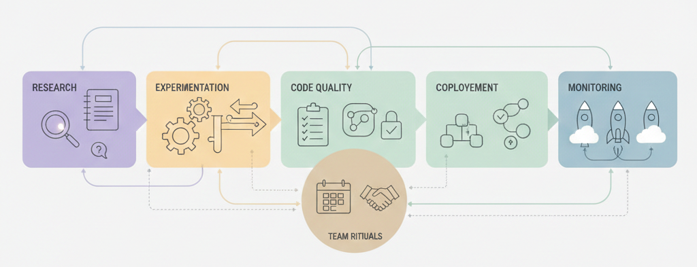

# DS Team Playbook

> Cómo trabajo y cómo lidero equipos de Data Science.

🔗 **Explora el playbook (versión web)**  
👉 <https://lin777.github.io/ds-team-playbook/>

---

Este repositorio documenta **las prácticas, acuerdos y decisiones**
que mejor me han funcionado trabajando y liderando equipos de Data Science.

No es teoría.
Es experiencia aplicada.

Aquí encontrarás cómo abordo:

- organización de proyectos de DS
- toma de decisiones técnicas (ADRs)
- experimentación y reproducibilidad
- colaboración, feedback y rituales de equipo
- paso de research a producción
- seguridad y responsabilidad

El objetivo es simple:
mostrar **cómo pienso más allá del modelo**
y ofrecer una forma de trabajo que escala.

---

### Stack del sitio

- MkDocs + Dracula Theme
- GitHub Actions (CI/CD)
- GitHub Pages
- `uv` para entornos y dependencias

---

Si este enfoque resuena contigo,
puedes contactarme vía **GitHub** o **LinkedIn**.
