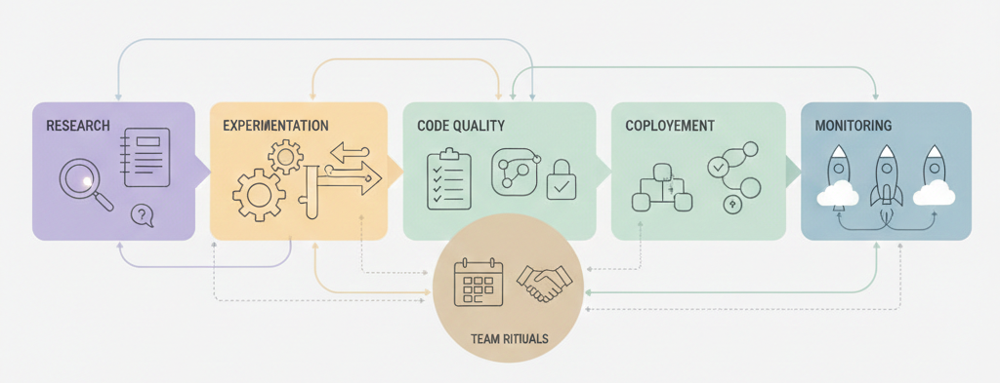

---
hide:
  - navigation
---

# DS Team Playbook 🪄🧝🏻‍♀️📘

Bienvenido/a. Este sitio es una colección de **prácticas, convenciones y decisiones** que usaría (y he aprendido a valorar) liderando equipos de Data Science.

No es “documentación por amor a documentar”.  
Es más bien un **anti-manual de supervivencia**: cosas que evitan bugs raros, PRs eternos, notebooks inmortales y ese clásico:

> “En mi máquina sí funciona.”

---

## Qué es esto (y qué no)

✅ **Es**

- Una guía de onboarding para moverte rápido sin depender de “pregúntale a alguien”
- Un set de estándares para que los proyectos se sientan familiares
- Un lugar donde documentamos decisiones técnicas (ADRs) para evitar discusiones cíclicas

❌ **No es**

- Una receta universal (si tu contexto cambia, estas reglas también pueden cambiar)
- Un reemplazo de pensar (si algo no tiene sentido, se cuestiona y se mejora)

!!! tip "Idea central"
    Estandarizar no es burocracia. Es **ahorrar energía mental** para dedicarla a lo importante: resolver problemas con datos.

---

## Por qué existe este playbook

Porque *no* tener estándares suele empezar así:

> “Hagámoslo rápido, después lo ordenamos.”

Y termina con:

- ambientes rotos en momentos críticos
- pipelines que nadie se atreve a tocar
- experimentos sin trazabilidad
- modelos en producción con “versión: final_final_v7.ipynb” (sí, pasa 😅)

!!! warning "War story (clásica)"
    Alguna vez un modelo cambió su performance “misteriosamente”.  
    ¿La causa? Una dependencia actualizada sin lockfile.  
    Fue una tarde muy larga. Y aprendimos.

---

## Cómo navegar el playbook

El contenido está ordenado para que puedas leerlo como un libro (o picar lo que necesitas):

- **01 · Visión y principios** → el “por qué”
- **02 · Onboarding** → cómo arrancar sin dolor
- **03 · Entornos y dependencias** → reproducibilidad y menos caos
- **04 · Estructura de proyectos** → repos consistentes
- **05 · Estándares de código** → legibilidad y mantenimiento
- **06 · Git y forma de trabajar** → colaboración sin sufrimiento
- **07 · Calidad, testing y CI** → detectar fallos antes de producción
- **08 · Experimentación y trazabilidad** → saber qué funcionó y por qué
- **09 · ML lifecycle y producción** → del notebook al mundo real
- **10 · Rituales, feedback y crecimiento** → cómo trabajamos en equipo
- **11 · Seguridad, privacidad y responsabilidad** → lo que no se negocia

---

## “Quick start” (para empezar hoy)

=== "Si vas a leer solo 3 cosas"
    1. **03 · Entornos y dependencias**  
       Para evitar el multiverso de Python.
    2. **06 · Git y forma de trabajar**  
       Para que revisar PRs no sea un deporte extremo.
    3. **08 · Experimentación y trazabilidad**  
       Para que “el modelo funciona” signifique algo reproducible.

=== "Si estás entrando a un equipo nuevo"
    1. Lee **02 · Onboarding**
    2. Configura tu entorno con **03 · Entornos**
    3. Haz un PR pequeño siguiendo **06 · Git**

=== "Si tu dolor actual es producción"
    1. Revisa **09 · ML lifecycle y producción**
    2. Asegúrate de que **07 · Calidad/CI** esté sólido
    3. Verifica **11 · Seguridad/privacidad**

---

## Principios (versión corta)

- **Reproducibilidad > heroísmo**  
  Si solo una persona puede correrlo, estamos a una renuncia de un incidente.

- **Decisiones explícitas**  
  Menos “porque siempre se hizo así”, más “porque elegimos esto por estas razones”.

- **Notebooks para explorar, código para producir**  
  El notebook es el laboratorio, no la fábrica.

- **Automatiza lo aburrido**  
  Todo lo repetible se automatiza. Lo manual eventualmente se rompe.

!!! info "Nota honesta"
    Algunas reglas nacen de buenas ideas.  
    Otras nacen de experiencias traumáticas con un `requirements.txt` sin pinning.  
    Ambas son válidas.

---

## Architecture Decision Records (ADR)

Cuando tomamos decisiones “opinables” (herramientas, estándares, estructura), las dejamos escritas para que:

- sea fácil entender el contexto
- podamos revisarlas sin drama
- el equipo no tenga que redescubrir la historia cada 3 meses

Ejemplo: **ADR-0001** (uso de `uv`).

---

## Cómo contribuir (sí, incluso si este repo es “tuyo”)

Este playbook mejora cuando se usa. Y cuando se usa, aparecen fricciones reales.

**Regla de oro**: si una convención molesta, no se ignora en silencio…  
se propone un cambio con contexto y ejemplos.

!!! tip "Formato recomendado"
    - Qué problema viste
    - Por qué la convención actual no ayuda
    - Propuesta concreta (idealmente con ejemplo)
    - Trade-offs

---

## Templates

Para no empezar desde cero cada vez:

- Pull Request template
- ADR template
- Model Cards
- Reportes de experimentos

---

## ¿Para quién es este repo?

- Data Scientists que quieran trabajar de forma más estructurada
- Leads que necesiten escalar equipos sin caos
- Hiring managers que quieran ver cómo pienso más allá del modelo

---

## Disclaimer

Este playbook no representa a ninguna empresa.  
Es un resumen de prácticas que considero efectivas para equipos de DS / ML que quieren moverse rápido **sin pagar intereses técnicos eternos**.
